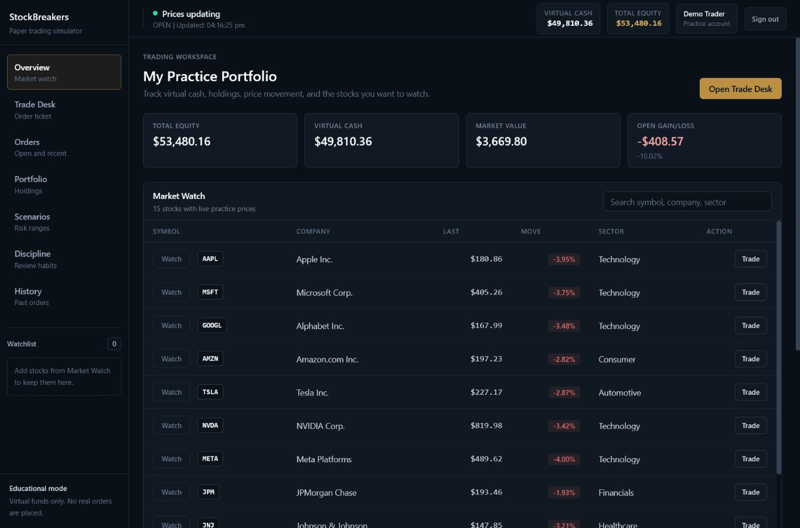
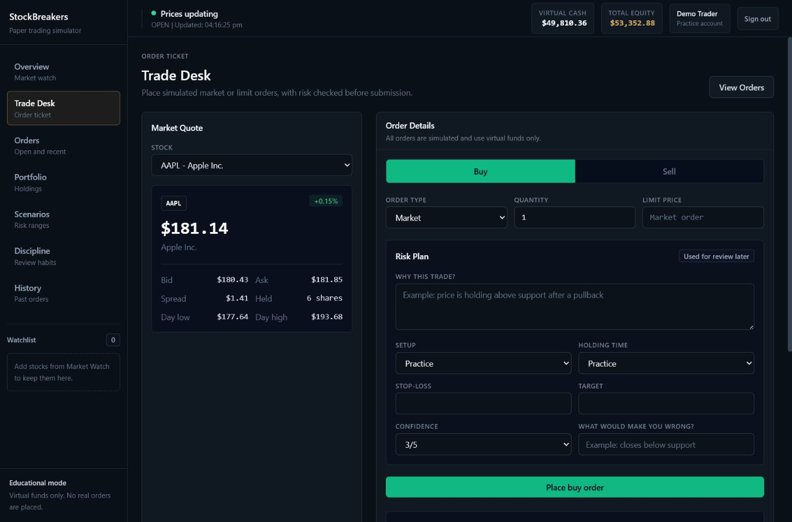
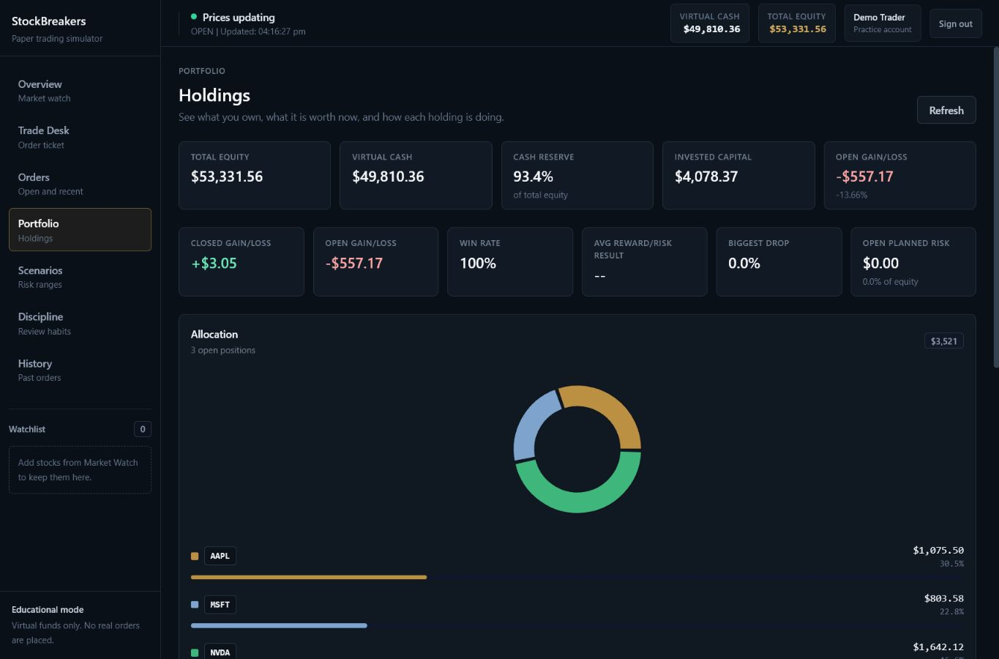
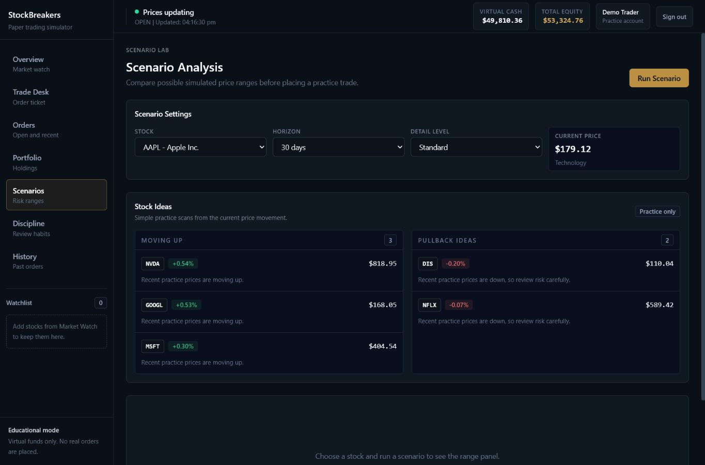
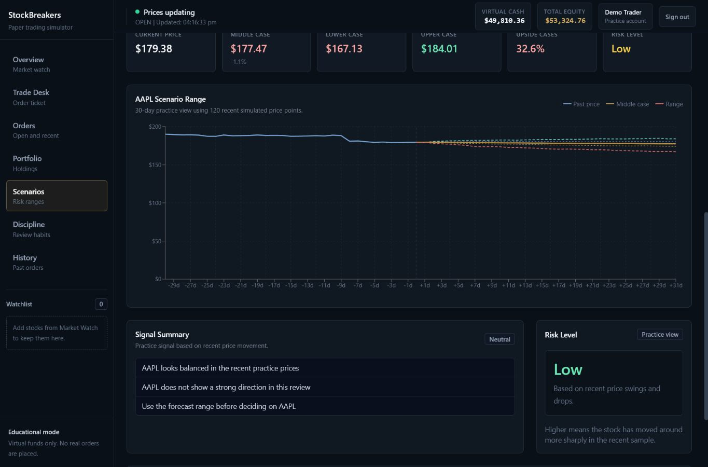
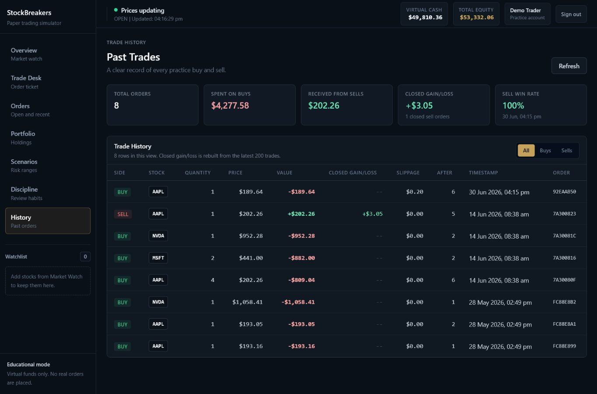
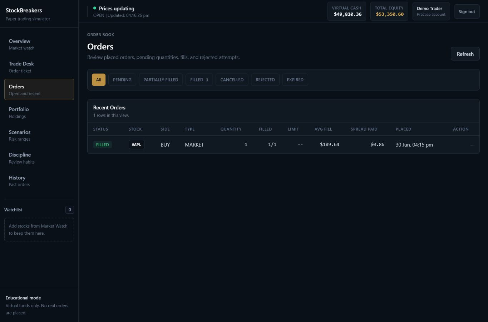
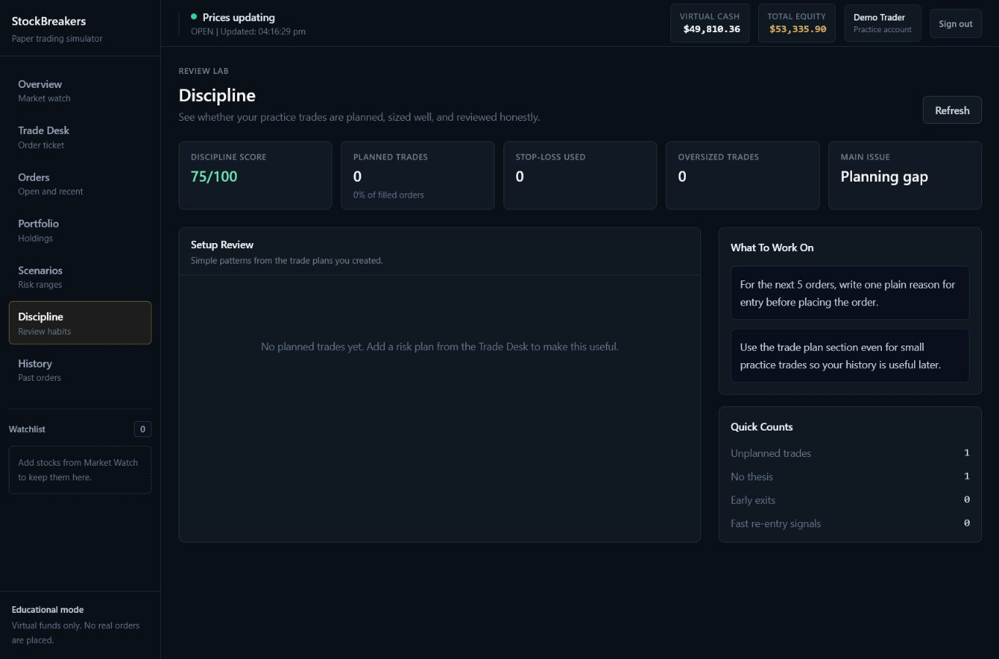
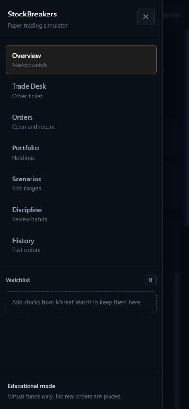

# StockBreakers

StockBreakers is a risk-first paper-trading simulator. It combines a clean React workspace, authenticated portfolio accounting, real-time practice prices, market and limit orders, pending order handling, virtual fills, trade history, scenario analysis, and discipline review.

> Educational paper-trading app only. StockBreakers does not provide financial advice and does not execute real trades.
> Prices, events, sessions, benchmarks, and scenario ranges are simulated for learning. They are not real market data.

[Live Demo](https://drawmebaaz.github.io/STOCK_BREAKERS/)

## Demo Access

The hosted demo uses browser-stored sample data so it can run permanently on GitHub Pages without exposing database credentials.

Docker app:

```text
http://localhost:3000
```

Demo login:

```text
Email:    demo@stockbreakers.local
Password: DemoPass123!
```

Seed the demo account after the Docker stack is healthy:

```bash
docker compose exec server npm run seed:demo
```

Full app deployment:

[Render free deployment guide](deploy/RENDER_FREE.md)

## What It Does

- Keeps each user account separate with its own virtual cash, watchlist, holdings, orders, and history.
- Runs a simulated market clock with pre-market, open, after-hours, and closed sessions.
- Moves prices through factor-based simulation using market sentiment, sector behavior, company profiles, liquidity, volatility, and generated events.
- Generates simulated market/news/earnings-like events that can widen spreads, increase volatility, and affect practice prices.
- Streams simulated market quotes with bid, ask, spread, volume, day range, and rolling candle history.
- Stores OHLCV candles for each ticker so charts and scenario inputs have open, high, low, close, and volume context.
- Calculates simulated benchmark indexes such as `SBX_TOTAL` and sector benchmarks for portfolio comparison.
- Supports market and limit orders with filled, pending, partially filled, cancelled, rejected, and expired states.
- Reserves virtual cash for pending buy limit orders and reserves shares for pending sell limit orders so users cannot reuse committed funds or shares.
- Wraps order creation and fill accounting in MongoDB transaction sessions when available, with a safe fallback for local standalone MongoDB.
- Records executed fills separately from orders so pending and cancelled orders are not mixed with completed trades.
- Helps users plan trades with thesis, stop-loss, target, confidence, and position-size checks.
- Shows portfolio analytics such as closed gain/loss, open gain/loss, win rate, drawdown, concentration, and open planned risk.
- Frames analytics as scenario analysis using simulated in-app history, not real-market prediction.
- Adds a discipline page that highlights planning gaps, missing stop-losses, oversized trades, and review habits.

## Core Features

Trading workspace:

- Real-time simulated market prices over Socket.IO
- Simulated session status with market open/closed context
- Market watch with searchable stocks and watchlist controls
- Market and limit order ticket
- Bid/ask, spread, estimated slippage, cash-after-order, and position-after-order visibility
- Pending limit-order reservation preview for cash or shares
- Active simulated event warning for selected stocks
- Stop-loss, target, thesis, confidence, setup type, and invalidation notes
- Position-size warning based on per-user risk settings
- Pending order result and cancel flow

Portfolio and history:

- Total equity, virtual cash, market value, and open gain/loss
- Holdings table with average cost, live value, and return %
- Allocation chart and holdings breakdown
- Closed gain/loss, win rate, drawdown, open planned risk, and exposure warnings
- Trade history with fill price, slippage, closed gain/loss, position-after-trade, and order IDs
- Separate Orders page for pending, filled, cancelled, rejected, and partially filled orders
- Simulated total-market context without pretending it is direct portfolio alpha

Scenario and review:

- Backend-maintained rolling price history per stock
- Simulated market session, event, and benchmark context around scenario runs
- Scenario range with lower, middle, and upper cases
- Risk level and plain-language notes about recent price behavior
- Stock ideas with short reasons for practice decisions
- Graceful fallback when the FastAPI scenario service is slow or unavailable
- Discipline page with score, biggest issue, setup review, and recommendation cards

## Screenshots

| Portfolio overview | Trade desk |
| --- | --- |
|  |  |

| Holdings | Research settings |
| --- | --- |
|  |  |

| Scenario range | Trade history |
| --- | --- |
|  |  |

| Orders | Discipline review |
| --- | --- |
|  |  |

| Mobile navigation |
| --- |
|  |

## Architecture

```text
Browser
  |-- React + Vite trading workspace
  |-- Zustand state management
  |-- Recharts charts
  |-- Socket.IO client with polling fallback
  v
Express API
  |-- Auth, orders, fills, holdings, transactions, watchlist
  |-- Order engine with bid/ask, slippage, partial fills, and idempotency
  |-- MarketClock sessions and simulated time
  |-- EventEngine for generated market/news/earnings-like events
  |-- FactorPricingEngine for bounded simulated price movement
  |-- CandleStore for in-memory OHLCV records
  |-- Simulated benchmark indexes
  |-- Market health metrics
  |-- Risk settings, portfolio analytics, and discipline summary
  |-- Backend rolling quote and candle history
  |-- Zod validation and security middleware
  |-- MongoDB persistence
  v
FastAPI Scenario Service
  |-- Simulated scenario range generation
  |-- Risk level calculation
  |-- Practice stock ideas
```

## Market Simulation Engine

StockBreakers does not stream real exchange data. It runs an in-app simulation engine designed to make paper trading more realistic and easier to explain.

Tick flow:

```text
MarketClock
  -> EventEngine
  -> MarketState
  -> FactorPricingEngine
  -> CandleStore
  -> BenchmarkIndex engine
  -> Socket.IO broadcast
  -> OrderEngine pending-order checks
```

MarketClock separates simulated market time from real server time. Instrument profiles give every ticker a personality: sector, style, volatility, liquidity, beta, investor confidence, demand, base spread, and average volume.

The pricing engine combines those profile values with market sentiment, sector sentiment, active simulated events, liquidity, volatility regime, and bounded noise. Generated events are clearly labeled as simulated. They are not real news.

Simulated benchmark indexes compare portfolio performance against the generated market:

- `SBX_TOTAL`: all instruments
- sector indexes: Technology, Financials, Healthcare, Consumer, Automotive, Entertainment

## Tech Stack

- Frontend: React 18, Vite 8, Tailwind CSS, Zustand, Recharts, Lucide
- Backend: Node.js 20+, Express, MongoDB, Mongoose, JWT, Socket.IO, Zod
- Research service: FastAPI, Pydantic 2, NumPy, Uvicorn
- Runtime/deploy: Docker Compose, Nginx, Render blueprint, GitHub Pages demo, health checks, readiness checks

## Scenario Flow

StockBreakers keeps the scenario flow transparent:

1. The backend price engine maintains rolling simulated price history for every stock.
2. The Scenario screen requests that history through the backend.
3. The Express API forwards the request to the FastAPI scenario service with a strict timeout.
4. The scenario service returns a range, risk level, and practice stock ideas.
5. If the service is down or slow, Express returns a simpler backend-only fallback instead of leaving the UI stuck.

The user sees:

- Current price
- Lower, middle, and upper cases
- Upside cases
- Risk level
- Plain-language notes about what to watch

## Docker Compose

Create a root `.env` from `.env.example` and set a strong `JWT_SECRET`:

```bash
cp .env.example .env
docker compose up --build
```

Docker URLs:

```text
Client: http://localhost:3000
API:    http://localhost:5000/api/health
Research service: http://localhost:8000/health
```

Seed the demo user:

```bash
docker compose exec server npm run seed:demo
```

## Local Development

Start MongoDB locally, then create environment files:

```bash
cp server/.env.example server/.env
cp client/.env.example client/.env
cp ml-service/.env.example ml-service/.env
```

Run services in separate terminals:

```bash
cd ml-service
pip install -r requirements.txt
uvicorn main:app --reload --port 8000
```

```bash
cd server
npm install
npm run dev
```

```bash
cd client
npm install
npm run dev
```

Local dev URLs:

```text
Client:     http://localhost:5173
API:        http://localhost:5000/api/health
API ready:  http://localhost:5000/api/ready
Research docs: http://localhost:8000/docs
```

## Environment Variables

Backend:

```text
NODE_ENV=production
PORT=5000
MONGO_URI=mongodb://localhost:27017/stockbreakers
JWT_SECRET=replace-with-a-64-character-random-secret
JWT_EXPIRES_IN=7d
ML_SERVICE_URL=http://localhost:8000
CLIENT_URL=http://localhost:5173
CORS_ORIGINS=http://localhost:5173
RATE_LIMIT_WINDOW_MS=900000
RATE_LIMIT_MAX=250
TRUST_PROXY=false
STATIC_DIR=
MARKET_CLOCK_ENABLED=true
MARKET_DEMO_ALWAYS_OPEN=false
SIM_MINUTES_PER_TICK=5
AFTER_HOURS_MINUTES_PER_TICK=30
MARKET_TICK_INTERVAL_MS=4000
```

Frontend:

```text
VITE_API_URL=http://localhost:5000/api
VITE_SOCKET_URL=http://localhost:5000
VITE_DEMO_MODE=false
VITE_BASE_PATH=/
```

Research service:

```text
CORS_ORIGINS=http://localhost:5173,http://localhost:5000
```

## API Surface

Auth:

- `POST /api/auth/register`
- `POST /api/auth/login`
- `GET /api/auth/me`

Market and portfolio:

- `GET /api/stocks`
- `GET /api/stocks/:ticker`
- `GET /api/market/status`
- `GET /api/market/events`
- `GET /api/market/events?ticker=AAPL`
- `GET /api/market/candles/:ticker?range=1D&interval=5m`
- `GET /api/market/indexes`
- `GET /api/market/indexes/:symbol`
- `GET /api/market/health`
- `POST /api/orders`
- `GET /api/orders`
- `GET /api/orders/:id`
- `POST /api/orders/:id/cancel`
- `POST /api/trade/buy`
- `POST /api/trade/sell`
- `GET /api/portfolio`
- `GET /api/portfolio/summary`
- `GET /api/portfolio/analytics`
- `GET /api/transactions?limit=50`
- `POST /api/watchlist/add`
- `POST /api/watchlist/remove`
- `GET /api/risk/settings`
- `PUT /api/risk/settings`
- `GET /api/discipline/summary`
- `GET /api/trade-plans`
- `GET /api/trade-plans/:id`
- `POST /api/trade-plans`
- `PATCH /api/trade-plans/:id`
- `POST /api/trade-plans/:id/review`

Scenario:

- `GET /api/ai/history/:ticker`
- `POST /api/ai/scenario`
- `POST /api/ai/predict`
- `POST /api/ai/sentiment`
- `POST /api/ai/risk`
- `GET /api/ai/suggestions`

Ops:

- `GET /api/health`
- `GET /api/ready`
- `GET /health` on the research service
- `GET /ready` on the research service

Development-only simulation controls:

- `GET /api/sim/state`
- `POST /api/sim/shock`
- `POST /api/sim/event`
- `POST /api/sim/fast-forward`
- `POST /api/sim/reset`

## Quality Checks

```bash
cd client
npm run build
```

```bash
cd client
VITE_DEMO_MODE=true VITE_BASE_PATH=/STOCK_BREAKERS/ npm run build
```

```bash
cd server
npm test
```

## Interview Notes

See [docs/interview-notes.md](docs/interview-notes.md) for the market-engine explanation, resume bullet, design choices, trade-offs, and limitations.

```bash
cd server
npm run audit:prod
```

```bash
cd ml-service
python -m compileall main.py
```

## Known Limitations

- Market data is simulated inside the app.
- Orders are simulated and never sent to a real broker.
- The fill model is simplified compared with real exchanges.
- Average-cost accounting is used instead of detailed tax lots.
- Scenario analysis is based on simulated in-app history and should not be treated as investment advice.
- Local MongoDB standalone mode uses safe sequential writes; a production replica set is required for true multi-document transactions.
